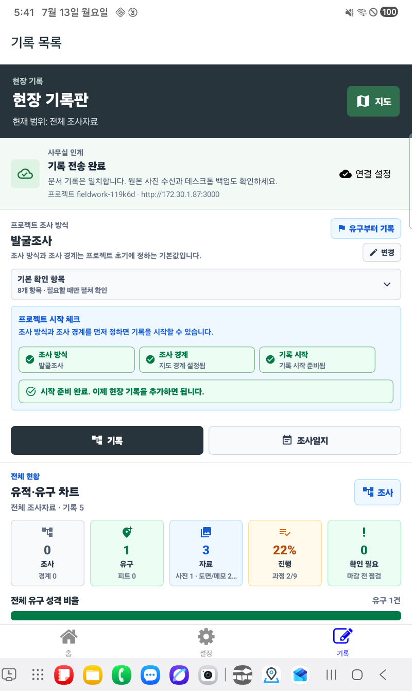
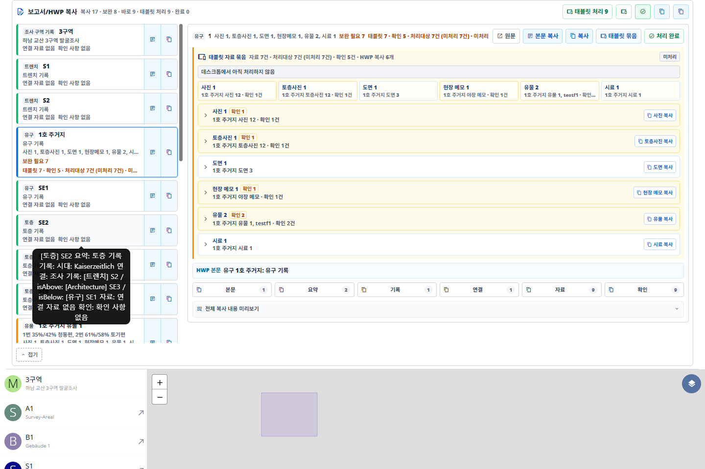
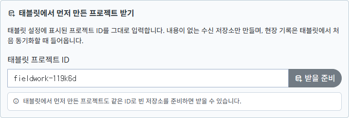

# 현장 기록

한국 고고학 발굴 현장에서 태블릿으로 남긴 기록을 원래 iDAI의 **Field Desktop**에서 검수하고, HWP 보고서 작성까지 이어 주기 위한 iDAI.field 기반 작업 저장소입니다.

현장에서는 태블릿으로 유구, 피트, 토층사진, 사진, 도면, 유물, 시료, 야장 메모를 빠르게 남기고, 사무실에서는 같은 자료를 Field Desktop에서 한눈에 확인한 뒤 HWP로 옮길 문장과 표 내용을 복사합니다.

원본은 독일고고학연구소(DAI)와 GBV가 개발한 [iDAI.field](https://github.com/dainst/idai-field)입니다. 이 저장소는 Apache-2.0 라이선스를 따르는 포크이며, 한국 현장조사 업무 흐름에 맞춘 별도 버전으로 운영합니다.

| 태블릿 현장 기록 | 사무실 Field Desktop |
| --- | --- |
|  |  |

두 화면은 그림 예시가 아니라 이 저장소의 태블릿 APK와 Field Desktop을 실제 실행해 캡처한 화면입니다.

태블릿과 데스크톱의 화면은 같지 않습니다. 태블릿은 현장에서 빠르게 입력하는 화면이고, Field Desktop은 같은 프로젝트 DB를 열어 관계·원본·누락을 검수하고 보고서 문장을 복사하는 화면입니다. 두 프로그램의 연속성은 화면 모양이 아니라 아래의 공통 프로젝트 ID와 데이터 계약으로 보장합니다.

## 먼저 설치하기

Git에 익숙하지 않다면 GitHub의 초록색 `Code` 버튼을 누르고 `Download ZIP`을 선택합니다. ZIP 압축을 푼 뒤 아래 파일을 더블클릭하면 됩니다.

### 데스크톱

기본 데스크톱 프로그램은 별도 시제품이 아니라 원래 iDAI의 **Field Desktop**입니다.

| 하고 싶은 일 | 더블클릭할 파일 | 결과 |
| --- | --- | --- |
| Field Desktop 열기 | `START_FIELD_DESKTOP.cmd` | 한국어 Field Desktop 실행 |
| C드라이브를 아끼며 Field Desktop 열기 | `START_FIELD_DESKTOP_TO_OTHER_DRIVE.cmd` | 임시 파일과 npm 캐시를 다른 드라이브에 두고 `Field Desktop (other drive cache)` 방식으로 실행 |
| 바탕화면 바로가기 만들기 | `INSTALL_FIELD_DESKTOP_SHORTCUT.cmd` | Field Desktop 바로가기 생성 |

처음 실행할 때는 필요한 개발 의존성을 설치하고 Angular 화면을 준비하므로 1-3분 정도 걸릴 수 있습니다. C드라이브 용량이 부족하면 다른 드라이브 캐시용 실행 파일을 사용하고, 예를 들어 `G:\idai-field-desktop-runtime` 같은 폴더를 지정합니다.

PowerShell에서 직접 실행할 때는 `IDAI_FIELD_RUNTIME_DIR`로 캐시 위치를 지정할 수 있습니다.

```powershell
$env:IDAI_FIELD_RUNTIME_DIR='G:\idai-field-desktop-runtime'
.\run-idai-field-ko.ps1
```

자세한 안내는 [Field Desktop 설치와 실행 안내](docs/korean-fieldwork/field-desktop-install.ko.md)에 있습니다.

### 태블릿

Android 태블릿 앱은 APK로 설치합니다. Google Play 배포를 전제로 하지 않으므로, USB로 태블릿을 연결한 뒤 아래 파일 중 하나를 실행합니다.

| 하고 싶은 일 | 더블클릭할 파일 | 결과 |
| --- | --- | --- |
| 이미 빌드된 최신 APK 설치 | `INSTALL_LATEST_TABLET_APK.cmd` | GitHub Actions 산출물을 내려받아 태블릿에 설치 |
| 방금 수정한 코드를 새 APK로 빌드하고 설치 | `BUILD_AND_INSTALL_TABLET_APK.cmd` | 현재 `master`를 GitHub Actions에서 빌드한 뒤 태블릿에 설치 |
| APK 파일만 내려받기 | `DOWNLOAD_LATEST_TABLET_APK.cmd` | 설치하지 않고 APK만 저장 |
| 방금 수정한 코드의 APK 파일만 만들기 | `BUILD_AND_DOWNLOAD_TABLET_APK.cmd` | 현재 `master`를 빌드하고 APK만 저장 |

C드라이브가 부족하면 `_TO_OTHER_DRIVE.cmd`가 붙은 파일을 사용합니다. 기본 작업 폴더는 `G:\idai-field-android`이며, APK와 Android platform-tools가 그 아래에 저장됩니다.

PowerShell에서 직접 실행할 때는 아래처럼 쓸 수 있습니다.

```powershell
.\install-idai-field-android-apk.ps1 -FromLatestArtifact -DownloadPlatformTools
.\install-idai-field-android-apk.ps1 -FromLatestArtifact -DownloadOnly
.\install-idai-field-android-apk.ps1 -BuildLatestArtifact -DownloadPlatformTools
.\install-idai-field-android-apk.ps1 -BuildLatestArtifact -DownloadOnly
.\install-idai-field-android-apk.ps1 -FromLatestArtifact -DownloadOnly -WorkDirectory G:\idai-field-android
```

항상 같은 다른 드라이브 작업 폴더를 쓰려면 `IDAI_FIELD_ANDROID_WORKDIR` 환경변수를 지정할 수 있습니다. 수정 직후 원격 `master`만 의도적으로 빌드하려면 `-AllowRefMismatch`를 추가합니다.

자세한 안내는 [Android 태블릿 설치 안내](docs/korean-fieldwork/android-tablet-install.ko.md)에 있습니다.

## 태블릿 자료를 데스크톱으로 받기

이 저장소의 목표는 태블릿과 데스크톱을 따로 노는 프로그램으로 만들지 않는 것입니다. 태블릿에서 적은 현장 정보가 최종적으로 Field Desktop에서 검수되고, HWP 보고서 작성에 도움이 되는 형태로 도착해야 합니다.

### 데스크톱에서 프로젝트를 먼저 만든 경우

1. 태블릿과 컴퓨터를 신뢰할 수 있는 같은 Wi-Fi에 연결합니다.
2. Field Desktop에서 프로젝트를 만들고 `설정 → 동기화`의 `LAN 동기화 허용`을 켠 뒤 저장합니다.
3. `설정`의 태블릿 연결 주소와 비밀번호를 확인합니다.
4. 태블릿에서 `서버에서 프로젝트 가져오기`로 같은 프로젝트를 받은 뒤 현장 기록을 시작합니다.
5. 태블릿 현장 기록판의 `사무실 인계` 상태가 `기록 전송 완료`인지 확인합니다.
6. 사무실에서 Field Desktop을 열어 기록 수, 상하위 관계, 사진 원본을 대조하고 백업합니다.

### 태블릿에서 프로젝트를 먼저 만든 경우

1. 태블릿 설정에 표시된 프로젝트 ID를 확인합니다. 예: `fieldwork-119k6d`.
2. 태블릿과 컴퓨터를 신뢰할 수 있는 같은 Wi-Fi에 연결하고, Field Desktop의 `설정 → 동기화`에서 `LAN 동기화 허용`을 켠 뒤 저장합니다.
3. `태블릿에서 먼저 만든 프로젝트 받기`에 그 ID를 그대로 입력하고 `받을 준비`를 누릅니다.
4. 태블릿 현장 기록판에서 `데스크톱 연결`을 눌러 Field Desktop에 표시된 URL과 비밀번호를 입력합니다.
5. `기록 전송 완료`가 뜨면 Field Desktop의 프로젝트 전환 메뉴에서 같은 ID를 엽니다.
6. `원본 사진 받기`가 켜져 있는지 확인한 뒤 사진과 도면까지 도착할 때까지 두 앱을 켜 둡니다.



프로젝트 ID는 기록을 담는 실제 데이터베이스 이름입니다. 두 기기에서 이름만 비슷하게 새 프로젝트를 각각 만들면 이어지지 않습니다. 반드시 같은 ID를 가져오거나, 태블릿 ID를 데스크톱에서 `받을 준비`해야 합니다.

### 실제로 이어지는 범위

| 태블릿에서 기록한 내용 | Field Desktop 도착 | 보고서 작업에서의 쓰임 |
| --- | --- | --- |
| 프로젝트 조사 방식, 경계 설명, 경계 도형 | 같은 프로젝트 문서와 도형으로 도착 | 조사 개요와 범위 검수 |
| 유구, 트렌치, 피트, 층위와 상하위 관계 | 식별자, 필드, 좌표, 관계를 보존 | 유구별 자료 묶음과 본문 초안 |
| 유물·시료와 사진 위/유구 안 위치점 | 위치 좌표와 부모 유구 관계를 보존 | 출토 위치와 수습 맥락 확인 |
| 사진, 토층사진, 도면, 펜 메모 | 기록과 미리보기 도착 | 근거 자료 목록과 캡션 작성 |
| 원본 사진·도면 파일 | `원본 사진 받기`가 켜져 있을 때 도착 | 도판·사진대장 원본 보관 |
| 토층사진 스포이드 위치와 색상값 | 사진 위 좌표와 색상값을 보존 | 토색 근거 대조와 HWP 근거 복사 |
| 조사일지, 야장 메모, 점검 상태 | 수정 이력과 함께 도착 | 2년 뒤 작성 시 당시 판단 근거 확인 |
| 지도 API 키, 연결 비밀번호 같은 기기 설정 | 동기화하지 않음 | 각 기기에서 별도 관리 |

문서 기록 동기화와 원본 파일 전송은 별도입니다. `기록 전송 완료`는 PouchDB 문서가 일치한다는 뜻이며, 원본 사진까지 장기 보존됐다는 뜻은 아닙니다. Field Desktop의 `원본 사진 받기`, 이미지 파일 수, 백업 위치를 따로 확인해야 합니다.

직접 연결과 Field Hub 동기화는 원본 업로드 상태를 문서에도 남깁니다. `fieldworkImageUploadStatus`는 전송 완료 여부, `fieldworkImageUploadedAt`은 전송 시각, `fieldworkImageUploadTarget`은 전송 대상을 뜻합니다. 이 값은 원본 인계 내역을 대조하기 위한 감사 정보이며, 실제 파일 보존 여부는 Field Desktop의 원본 파일과 백업에서 다시 확인합니다.

### 2026-07-13 실기기 인계 확인

Samsung SM-X115N 태블릿과 설치된 Field Desktop 3.8.0을 같은 Wi-Fi에 연결해 `fieldwork-119k6d` 프로젝트를 실제로 전송했습니다.

| 확인 항목 | 실제 결과 |
| --- | --- |
| 프로젝트 문서 | Project, Configuration, Operation, DailyLog, SurveyBoundary, Feature, Find, Sample, SoilProfilePhoto, Drawing, PenMemo 각 1건, 총 11건 도착 |
| 유구 관계 | 유물·시료·토층사진·도면·펜메모가 부모 유구 관계를 유지 |
| 위치 기록 | 유물 위치점 3개와 시료 위치점 1개, 토층사진 스포이드 좌표와 `10YR 6/3` 값 유지 |
| 원본 사진 | 191,989바이트 원본 1장 도착, 태블릿 업로드 기록과 데스크톱 저장 크기·해시 일치 |
| HWP 복사 | 실제 Electron 복사 버튼으로 일반 텍스트가 들어가고 HTML 클립보드는 비어 있음을 확인 |

이 검증은 현재 구현이 원래 Field Desktop과 분리된 별도 저장 체계가 아님을 보여줍니다. 다만 Wi-Fi 주소는 접속할 때마다 바뀔 수 있고, 지도 API 키·연결 비밀번호 같은 기기 설정과 장기 백업은 자동 인계 대상이 아닙니다. `LAN 동기화 허용`은 기본적으로 꺼져 있으며, 로컬 HTTP 연결은 현장 또는 사무실의 신뢰할 수 있는 Wi-Fi에서만 켭니다. 인계와 원본 확인이 끝나면 다시 끕니다.

HWP에 붙여넣을 때 문서 양식이 흐트러지지 않도록 복사 내용은 기본적으로 일반 텍스트 클립보드에 가깝게 다룹니다. 서식까지 강하게 들고 가는 대신, 작성 중인 HWP 양식 안에 안정적으로 들어가는 것을 우선합니다.

## 사무실 도착 뒤 5분 점검

현장 기록을 2년 뒤 보고서까지 이어가려면 태블릿 한 대에만 남겨 두지 않습니다.

1. Field Desktop을 먼저 켜고 태블릿과 같은 Wi-Fi인지 확인한 뒤 `LAN 동기화 허용`을 켭니다.
2. 태블릿의 `사무실 인계`가 `기록 전송 완료`인지 확인합니다.
3. Field Desktop에서 같은 프로젝트 ID를 열고 유구·유물·시료 수와 대표 관계를 대조합니다.
4. 원본 사진 수신을 켜고 사진·도면 파일 수와 열림 여부를 확인합니다.
5. Field Desktop 백업을 실행하고 백업 폴더가 실제로 다른 저장장치에도 복제됐는지 확인합니다.

점검이 끝나면 Field Desktop의 `LAN 동기화 허용`을 다시 끕니다.

상시 여러 현장과 사무실을 연결할 때는 Field Hub를 추가할 수 있습니다. 직접 연결과 Field Hub 모두 같은 프로젝트 문서 및 `original_image` 파일 규약을 사용합니다. 보고서 사진 인계를 별도로 묶을 때는 Field Desktop 이미지 내보내기의 `fieldwork-image-export-manifest.json`, `fieldwork-image-export-manifest.csv`, `fieldwork-image-export-readme.txt`로 원본 파일명, 태블릿 표시, 토층사진 스포이드 위치를 대조합니다.

## Field Desktop 중심 원칙

데스크톱 본체는 `desktop` 아래의 Electron/Angular 기반 Field Desktop입니다. 한국어 현장기록 기능도 최종적으로는 Field Desktop 안에서 검토하고 쓰는 것을 기준으로 합니다.

`tools\bridgedesk`의 BridgeDesk는 별도 제품이 아닙니다. HWP 복사 문장과 표 형식을 빠르게 검증하기 위한 보조 시제품입니다. 실제 운영 입구는 Field Desktop이며, BridgeDesk에서 검증한 좋은 흐름은 Field Desktop 안으로 옮기는 것을 목표로 합니다.

## 보고서/HWP 복사

Field Desktop의 보고서 보조 화면은 HWP 옆에 띄워두고 쓰는 작업대를 목표로 합니다.

자료가 많이 쌓여도 모두 펼쳐 놓지 않습니다. 왼쪽의 짧은 기록 목록에서 유구·유물·시료를 고르면 오른쪽에 그 기록 하나의 검수 내용만 나타나며, 사진·토층사진·도면·메모 같은 태블릿 자료 묶음과 전체 복사 미리보기는 기본적으로 접혀 있습니다. 작은 노트북 화면에서는 목록과 상세 작업대가 위아래로 바뀝니다.

- `본문 복사`: 보고서 본문에 바로 넣기 좋은 짧은 문장 복사
- `복사`: 요약, 근거 자료, 확인 항목을 함께 복사
- `근거 복사`: 사진, 도면, 스포이드 위치, 야장 메모 같은 근거만 복사
- `확인 복사`: 마감 전에 확인할 누락 항목만 복사
- `표 행 복사`: 선택한 기록 하나를 HWP 표에 붙여넣기 쉬운 한 줄로 복사

보고서 작성은 조사 완료 뒤의 일입니다. 그래서 태블릿 입력 중에는 HWP 안내를 과하게 띄우지 않고, 데스크톱 검수 단계에서 보고서 보조 기능을 쓰는 방향을 유지합니다.

보고서/HWP 복사 기능은 Field Desktop 안에서 우선 사용하고, BridgeDesk는 새 복사 문장과 표 형식을 검증할 때만 보조로 둡니다.

## 주요 기능

- 발굴조사, 시굴조사, 표본조사 방식에 맞춘 프로젝트 시작 흐름
- 지도 위 조사 경계와 유구 점 연결 기록
- 유구별 사진, 토층사진, 도면, 펜 메모, 유물, 시료 추가
- 유물과 시료의 유구 내 위치 기록
- 토층사진 색상 스포이드와 사진 위 위치 표시
- 피트 기록의 직선 입력
- 유구 자료가 많아져도 목록, 요약, 우선순위로 훑는 현장 작업대
- Field Desktop에서 태블릿 자료 검수와 HWP 복사 지원
- APK 설치와 데스크톱 실행을 위한 Windows 더블클릭 입구

## 개발자가 수정한 뒤 태블릿에 바로 설치하기

코드를 고친 뒤 태블릿에 바로 넣을 때는 이 순서를 지킵니다.

1. 수정 내용을 테스트합니다.
2. `master`에 커밋하고 `origin/master`로 푸시합니다.
3. `BUILD_AND_INSTALL_TABLET_APK.cmd`를 실행합니다.
4. GitHub Actions가 새 APK를 빌드하면 연결된 Android 태블릿에 설치됩니다.

이 명령은 로컬 작업트리와 GitHub의 `master`가 맞는지 확인합니다. 커밋하지 않은 수정이나 푸시하지 않은 커밋이 있으면 설치를 멈추도록 되어 있습니다.

## 개발 구조

| 경로 | 역할 |
| --- | --- |
| `core` | 공통 TypeScript 모델, 설정, 동기화 보조 로직 |
| `desktop` | Angular/Electron 기반 Field Desktop |
| `mobile` | React Native/Expo 기반 Android 태블릿 앱 |
| `server` | Field Hub 동기화 서버 |
| `publication` | 공개/출판 관련 코드 |
| `tools\bridgedesk` | HWP 보고서 문장 검증용 보조 도구 |

처음 개발 환경을 준비할 때는 의존성을 설치합니다.

```bash
npm run bootstrap
```

Android APK를 직접 만들려면 Node.js 20 이상, JDK 17 이상, Android SDK(platform-tools 포함)가 필요합니다.

```powershell
.\build-idai-field-android-apk.ps1 -Variant release
```

개발 중 태블릿에 바로 설치하고 Metro 서버를 띄우려면 다음 흐름을 사용합니다.

```powershell
.\run-idai-field-tablet-ko.ps1 -InstallDebug
.\run-idai-field-tablet-ko.ps1
```

Expo Go는 사용하지 않습니다. 저장소, 파일, 지도, 이미지 처리, 암호화 같은 네이티브 모듈을 쓰므로 개발 빌드나 APK로 실행해야 합니다.

## 검증

한국 현장기록 흐름을 한 번에 확인합니다.

```bash
npm run check:korean-fieldwork
```

데스크톱 빌드까지 포함해 넓게 확인하려면 다음 명령을 사용합니다.

```bash
npm run check:korean-fieldwork:full
```

모바일 테스트만 직접 돌릴 때는 다음 명령을 사용합니다.

```powershell
npm --prefix mobile run test:ci -- --silent
```

태블릿에서 작성한 원자료가 Field Desktop의 `보고서/HWP 복사` 패널과 Electron 클립보드까지 이어지는지 확인하려면 커밋 메시지에 `[handoff-e2e]`를 포함해 푸시합니다. Desktop workflow가 `npm run e2e:korean-fieldwork-handoff`를 실행해 유구의 태블릿 자료 묶음 복사, 처리대상/미처리 상태, 원본 파일명, 토층사진 스포이드 색상값이 HWP로 옮길 수 있는 텍스트로 보존되는지 확인합니다.

## 문서

- [Field Desktop 설치와 실행 안내](docs/korean-fieldwork/field-desktop-install.ko.md)
- [Android 태블릿 설치 안내](docs/korean-fieldwork/android-tablet-install.ko.md)
- [BridgeDesk 설치와 실행 입구](docs/korean-fieldwork/bridgedesk-installation.md)
- [현장 적용 연구 노트](docs/korean-fieldwork/README.md)
- [한국형 야장 구현 요구사항](docs/korean-fieldwork/field-notebook-requirements.md)
- [한국형 야장 기록 워크플로](docs/korean-fieldwork/field-recording-workflows.md)
- [iDAI.field wiki 한국어 번역](docs/wiki/README.md)

## 운영 원칙

이 저장소는 원본 iDAI.field에 부담을 넘기기 위한 Pull Request 작업장이 아니라, 한국 현장조사 흐름을 이 포크 안에서 검증하고 운영하기 위한 저장소입니다.

필요한 변경은 이 저장소 안에서 커밋, 빌드, APK, 문서로 처리합니다. 원본 프로젝트와 원작자에게 사전 합의 없는 PR, 멘션, 한국형 기능 검토 요청, 사용자 지원 부담을 보내지 않는 것을 운영 기준으로 삼습니다.

## 출처와 라이선스

- 원본 저장소: [dainst/idai-field](https://github.com/dainst/idai-field)
- 원본 프로젝트 사이트: [field.idai.world](https://field.idai.world/)
- 원본 문서: [iDAI.field wiki](https://github.com/dainst/idai-field/wiki)
- 라이선스: Apache License 2.0
- 출처 고지: [NOTICE.md](NOTICE.md)
- 참고 논문: S. Hohl, T. Kleinke, F. Riebschläger, J. Watson, **iDAI.field: developing software for the documentation of archaeological fieldwork**, *Archeologia e Calcolatori* 34.1, 2023, 85-94. DOI: [10.19282/ac.34.1.2023.10](https://doi.org/10.19282/ac.34.1.2023.10)
