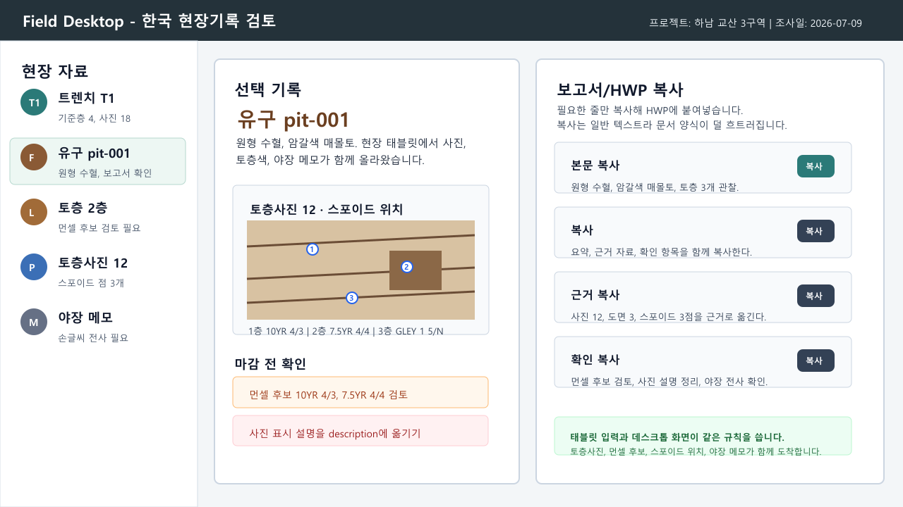

# Field Desktop 설치와 실행 안내

이 문서는 Git이나 GitHub에 익숙하지 않은 사용자가 Windows에서 Field Desktop을 여는 방법을 설명합니다. 이 저장소의 기본 데스크톱 입구는 `tools\bridgedesk`가 아니라 원래 iDAI의 Electron/Angular 기반 **Field Desktop**입니다.



## 가장 쉬운 실행

1. GitHub에서 초록색 `Code` 버튼을 누릅니다.
2. `Download ZIP`을 눌러 파일을 내려받습니다.
3. ZIP 압축을 풉니다.
4. 압축을 푼 폴더에서 `START_FIELD_DESKTOP.cmd`를 더블클릭합니다.

처음 실행할 때는 필요한 프로그램 묶음과 화면 번들을 준비하므로 몇 분 걸릴 수 있습니다. 창에 `Generating browser application bundles` 또는 점(`.`)이 계속 보이면 그대로 기다립니다.

## C드라이브 용량이 부족할 때

가장 확실한 방법은 압축을 푼 저장소 폴더 전체를 `G:\idai-field` 같은 다른 드라이브에 두는 것입니다. 이미 C드라이브에 풀었다면 Windows 탐색기에서 폴더를 통째로 다른 드라이브로 옮긴 뒤, 옮긴 폴더 안의 `START_FIELD_DESKTOP.cmd`를 실행합니다.

저장소는 C드라이브에 두되 임시파일과 npm 캐시만 다른 드라이브에 두려면 `START_FIELD_DESKTOP_TO_OTHER_DRIVE.cmd`를 실행합니다. 물어보는 위치에 예를 들어 `G:\idai-field-desktop-runtime`을 입력합니다.

PowerShell에서 직접 지정하려면 다음처럼 실행합니다.

```powershell
$env:IDAI_FIELD_RUNTIME_DIR='G:\idai-field-desktop-runtime'
.\run-idai-field-ko.ps1
```

## 바탕화면 바로가기 만들기

루트 폴더에서 `INSTALL_FIELD_DESKTOP_SHORTCUT.cmd`를 더블클릭하면 바탕화면에 다음 바로가기가 만들어집니다.

- `Field Desktop`
- `Field Desktop (other drive cache)`

두 번째 바로가기는 C드라이브가 부족한 컴퓨터에서 임시파일과 캐시 위치를 다른 드라이브로 지정할 때 사용합니다.

## 실행 중 보이는 메시지

정상 실행 흐름에서는 대략 다음 메시지가 보입니다.

```text
Starting iDAI Field in Korean.
Building the Korean development bundle. The first run can take 1-3 minutes.
Development server is ready.
Opening the app window.
```

첫 실행이 오래 걸리는 것은 보통 오류가 아닙니다. Angular 개발 서버가 화면 파일을 만들고 Electron 창을 여는 과정입니다.

## HWP 보고서 작성 흐름

태블릿에서 입력한 사진, 토층색, 스포이드 위치, 야장 메모, 보완 검토 항목은 Field Desktop에서 같은 core 규칙으로 읽힙니다. Field Desktop의 보고서/HWP 복사 화면에서는 HWP 본문에 바로 붙일 문장은 `본문 복사`로, 근거 자료와 확인 항목까지 함께 옮길 때는 `복사`나 섹션별 복사로 나누어 붙여넣습니다.

붙여넣기할 때 HWP 양식이 흐트러지지 않도록 복사 내용은 일반 텍스트를 우선 사용합니다. 웹페이지나 리치 텍스트 서식을 같이 밀어 넣지 않는 방향입니다.

## 문제 해결

- 창이 안 열리면 터미널의 마지막 오류 메시지를 확인합니다.
- `Node/npm runtime was not found`가 나오면 Node.js를 설치하거나 Codex 앱을 한 번 실행해 번들 Node 런타임을 복구합니다.
- 포트 `4200`이 이미 사용 중이면 실행 스크립트가 같은 저장소의 오래된 Angular 서버를 찾아 종료한 뒤 다시 시작합니다.
- C드라이브가 부족하면 저장소 폴더 전체를 다른 드라이브로 옮기거나 `START_FIELD_DESKTOP_TO_OTHER_DRIVE.cmd`를 사용합니다.

## 관련 입구

| 파일 | 용도 |
| --- | --- |
| `START_FIELD_DESKTOP.cmd` | Field Desktop 실행 |
| `START_FIELD_DESKTOP_TO_OTHER_DRIVE.cmd` | 다른 드라이브 캐시를 쓰며 Field Desktop 실행 |
| `INSTALL_FIELD_DESKTOP_SHORTCUT.cmd` | 바탕화면 바로가기 생성 |
| `run-idai-field-ko.ps1` | PowerShell에서 직접 실행 |
| `START_BRIDGEDESK_DESKTOP.cmd` | HWP 복사 형식 검증용 임시 BridgeDesk 실행 |
