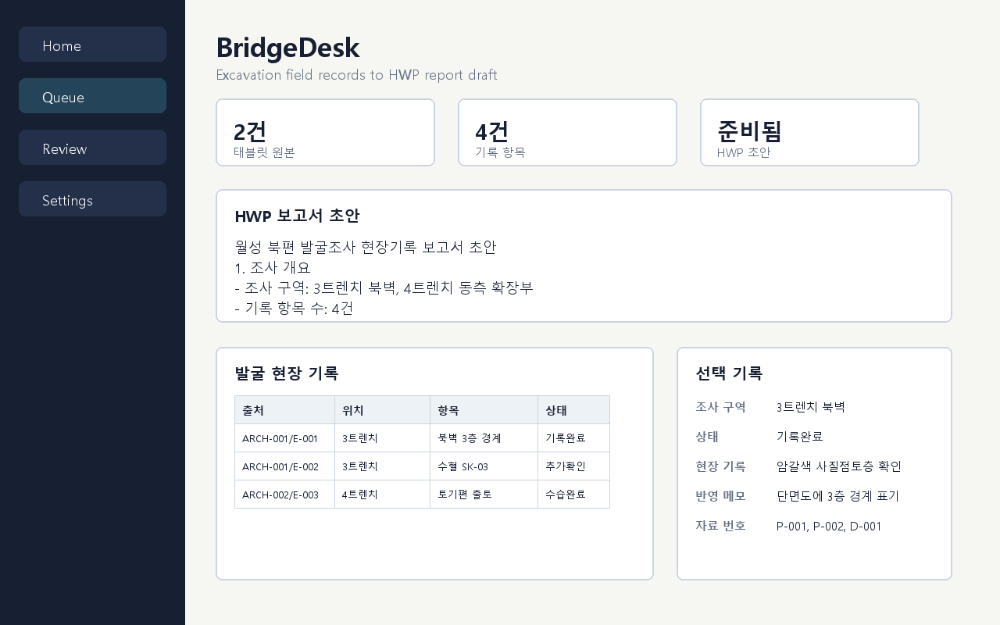
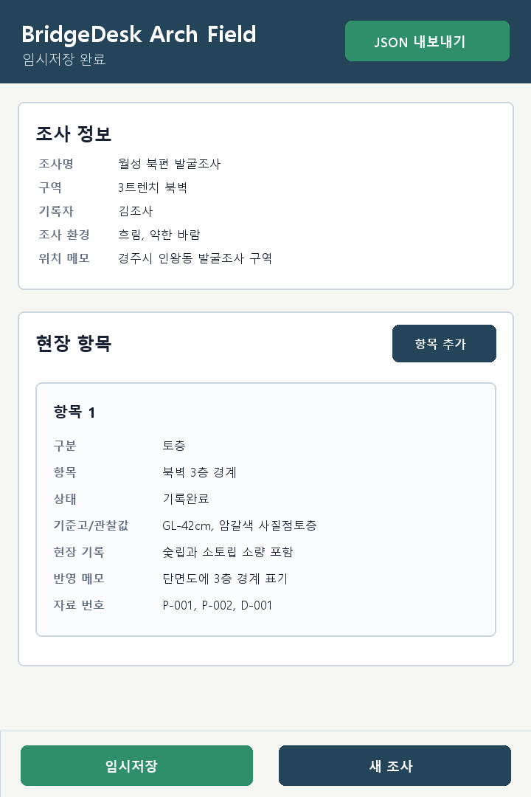

# BridgeDesk

태블릿에서 현장 내용을 적고, 데스크톱에서 검수한 뒤, HWP 보고서에 붙여 넣을 초안과 표를 만드는 작은 업무용 프로그램입니다. Git이나 명령어를 몰라도 쓸 수 있도록 더블클릭 입구를 제공합니다.





## 처음 설치하기

### 데스크톱 PC

1. 받은 폴더를 원하는 위치에 압축 해제합니다.
2. `START_DESKTOP.cmd`를 더블클릭합니다.
3. 바탕화면 바로가기가 필요하면 `INSTALL_DESKTOP_SHORTCUTS.cmd`를 더블클릭합니다.
4. HWP 보고서용 파일을 만들려면 `EXPORT_HWP_REPORT.cmd`를 더블클릭합니다.

`dist\BridgeDesk\BridgeDesk.exe`가 있으면 `START_DESKTOP.cmd`는 그 실행 파일을 먼저 엽니다. 실행 파일이 아직 없으면 설치된 Python으로 프로그램을 실행합니다.

자세한 설명은 [데스크톱 설치 문서](docs/INSTALL_DESKTOP.md)를 보세요.

### 태블릿

1. 데스크톱 PC에서 `START_TABLET_SERVER.cmd`를 더블클릭합니다.
2. 검은 창에 표시되는 주소를 확인합니다. 예: `http://192.168.0.12:8765/tablet/`
3. 태블릿을 같은 Wi-Fi에 연결합니다.
4. 태블릿 브라우저에서 위 주소를 엽니다.
5. 브라우저 메뉴에서 홈 화면에 추가합니다.
6. 현장 항목을 입력하고 `JSON 내보내기`를 누릅니다.
7. 내려받은 JSON 파일을 데스크톱의 `data\inbox` 폴더에 넣습니다.
8. 데스크톱에서 `START_DESKTOP.cmd` 또는 `EXPORT_HWP_REPORT.cmd`를 실행합니다.

태블릿 앱은 앱스토어 설치 앱이 아니라 브라우저 앱입니다. 첫 로드 후에는 필요한 파일을 캐시하므로 현장 네트워크가 불안정해도 입력 화면 자체는 계속 열릴 수 있습니다.

자세한 설명은 [태블릿 설치 문서](docs/INSTALL_TABLET.md)를 보세요.

## 더블클릭 입구

- `START_DESKTOP.cmd`: 데스크톱 검수/보고서 미리보기 프로그램 실행
- `START_TABLET_SERVER.cmd`: 태블릿 입력 화면을 같은 Wi-Fi에 공개
- `EXPORT_HWP_REPORT.cmd`: HWP 보고서 작성용 TXT, HTML, CSV, JSON 생성
- `INSTALL_DESKTOP_SHORTCUTS.cmd`: 바탕화면 바로가기 생성
- `BUILD_DESKTOP_EXE.cmd`: 독립 실행형 `BridgeDesk.exe`와 `BridgeDeskTabletServer.exe` 생성
- `BUILD_USER_PACKAGE.cmd`: 사용자 배포용 zip 생성

## 보고서 파일 위치

`EXPORT_HWP_REPORT.cmd`를 실행하면 아래 파일들이 만들어집니다.

- `exports\report-draft\hwp_report_draft.txt`: HWP 본문에 붙여넣기 쉬운 초안
- `exports\report-draft\hwp_report_draft.html`: 브라우저나 HWP에서 열어볼 수 있는 표 포함 초안
- `exports\report-draft\field_findings.csv`: 표 계산/검수용 CSV
- `exports\report-draft\normalized_tablet_payload.json`: 정규화된 태블릿 입력 데이터

## 태블릿 JSON 넣는 곳

태블릿에서 내보낸 JSON 파일은 `data\inbox` 폴더에 넣으면 됩니다. 프로그램은 시작할 때 이 폴더의 모든 `*.json` 파일을 읽습니다.

`data\inbox`가 비어 있으면 예시 데이터인 `data\tablet_submissions.json`을 읽어서 화면과 보고서 흐름을 확인할 수 있습니다.

## 직접 실행 명령

명령어에 익숙한 경우 아래처럼 실행할 수 있습니다.

```powershell
python -m compatdesk
python -m compatdesk --preview-report
python -m compatdesk --export-report exports/report-draft
python -m compatdesk --compare 820x720 1280x800
```

## 테스트

```powershell
python -m unittest discover -s tests
```

## 구조

- `compatdesk.layout_policy`: 태블릿/데스크톱 레이아웃 정책
- `compatdesk.compatibility`: 태블릿과 데스크톱의 기능/필드 누락 검증
- `compatdesk.field_data`: 태블릿 JSON을 보고서용 데이터로 정규화
- `compatdesk.report_export`: HWP 작성 보조용 TXT, HTML, CSV, JSON 생성
- `tablet`: 태블릿 브라우저 입력 앱
- `installers`: 데스크톱 바로가기와 실행 보조 스크립트
- `tools`: 서버 실행, exe 빌드, 배포 zip 생성, 스크린샷 생성 도구
